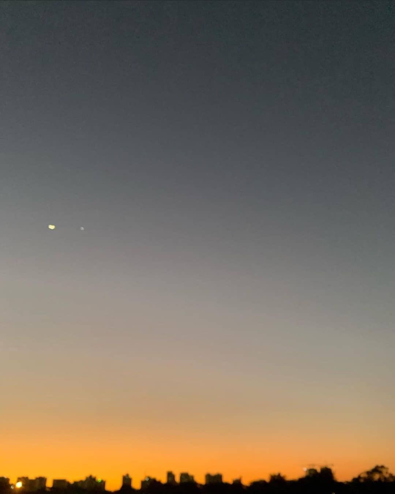

<h1 align="center">Hi ,  I'm m00nb0w </h1>
<h3 align="center">A developer who loves to build things that matter</h3>

<br/>

## 💻 About me

- 🔭 I’m currently working fulltime at Axon Enterprise 

- 👯 I’m looking to collaborate on **anything free and open source**

- 🧠 I am currently learning **Golang** and **Functional Programming** 

- ⚡ Fun fact **I love stats, you will see lots of stats down there**


<br/><br/>[](https://github.com/ryo-ma/github-profile-trophy)<br/><br/>

## 🔧 What I've been learning and using so far



### Languages
<p align="left">


</p>

### Backend
<p align="left">


</p>

### Frontend
<p align="left">


</p>

### Others
<p align="left">


</p>

<br/>

## 📈 GitHub Stats

<p>
<a href="https://github.com/m00nb0w">
  
  
</a>
</p>

<br/>

## 💪 Personal Stats
<!--START_SECTION:waka-->


**I'm a Night 🦉** 

```text
🌞 Morning                1158 commits        ███████░░░░░░░░░░░░░░░░░░   27.25 % 
🌆 Daytime                927 commits         █████░░░░░░░░░░░░░░░░░░░░   21.82 % 
🌃 Evening                681 commits         ████░░░░░░░░░░░░░░░░░░░░░   16.03 % 
🌙 Night                  1483 commits        █████████░░░░░░░░░░░░░░░░   34.90 % 
```
📅 **I'm Most Productive on Sunday** 

```text
Monday                   549 commits         ███░░░░░░░░░░░░░░░░░░░░░░   12.92 % 
Tuesday                  485 commits         ███░░░░░░░░░░░░░░░░░░░░░░   11.41 % 
Wednesday                557 commits         ███░░░░░░░░░░░░░░░░░░░░░░   13.11 % 
Thursday                 685 commits         ████░░░░░░░░░░░░░░░░░░░░░   16.12 % 
Friday                   547 commits         ███░░░░░░░░░░░░░░░░░░░░░░   12.87 % 
Saturday                 637 commits         ████░░░░░░░░░░░░░░░░░░░░░   14.99 % 
Sunday                   789 commits         █████░░░░░░░░░░░░░░░░░░░░   18.57 % 
```


📊 **This Week I Spent My Time On** 

```text
🕑︎ Time Zone: Asia/Ho_Chi_Minh

💬 Programming Languages: 
No Activity Tracked This Week

🔥 Editors: 
No Activity Tracked This Week

💻 Operating System: 
No Activity Tracked This Week
```

🤖 **AI Coding This Week** 

```text
No AI Coding Activity Tracked This Week
```

**I Mostly Code in JavaScript** 

```text
JavaScript               5 repos             █████████░░░░░░░░░░░░░░░░   35.71 % 
Python                   3 repos             █████░░░░░░░░░░░░░░░░░░░░   21.43 % 
Go                       2 repos             ████░░░░░░░░░░░░░░░░░░░░░   14.29 % 
Shell                    2 repos             ████░░░░░░░░░░░░░░░░░░░░░   14.29 % 
C                        1 repo              ██░░░░░░░░░░░░░░░░░░░░░░░   07.14 % 
```


 Last Updated on 23/09/2026 02:41:43 UTC
<!--END_SECTION:waka-->
